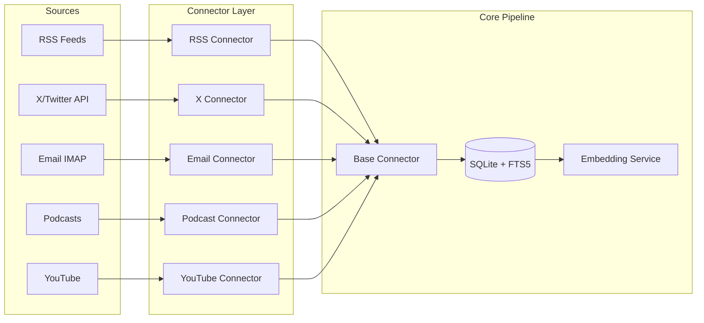
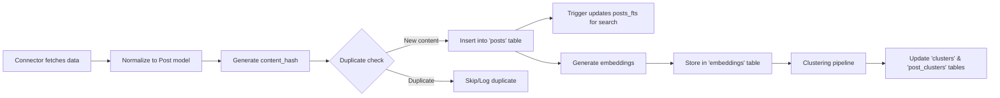

# Connector System Design Document

## Executive Summary

This document outlines the design for a pluggable connector system that ingests content from multiple source types (RSS, X/Twitter, Email, Podcast, YouTube) into a unified data pipeline. The system emphasizes modularity, type safety, and consistent behavior across all connector types.

## System Overview

### Architecture Diagram



### Data Flow



## Design Principles

1. **Single Responsibility**: Each connector handles one source type
2. **Interface Segregation**: Minimal required interface for connector implementation
3. **Dependency Inversion**: Connectors depend on abstractions, not concrete implementations
4. **Open/Closed**: Easy to add new connectors without modifying existing code
5. **Type Safety**: Full typing with Pydantic models and type hints

## Core Components

### 1. Configuration System

Each connector type has a strongly-typed configuration model:

```python
# Base configuration interface
class BaseConnectorConfig(BaseModel):
    enabled: bool
    fetch_interval_minutes: int
    max_items_per_fetch: Optional[int]
    retry_attempts: int
    timeout_seconds: int
    custom_headers: Optional[Dict[str, str]]

# Example: RSS-specific configuration
class RSSConfig(BaseConnectorConfig):
    parse_full_content: bool
    filter_keywords: Optional[List[str]]
    exclude_keywords: Optional[List[str]]
```

**Configuration Storage**: Stored in `sources.config_json` as validated JSON

### 2. Base Connector Interface

All connectors implement this interface:

```python
class BaseConnector(ABC):
    """Abstract base class for content connectors."""
    
    def __init__(self, source: Source, db: Database):
        """Initialize with source configuration and database connection."""
        
    @abstractmethod
    async def fetch_raw_data(self) -> AsyncIterator[Dict[str, Any]]:
        """Yield raw data items from the source."""
        
    @abstractmethod
    def normalize_to_post(self, raw_data: Dict[str, Any]) -> Optional[Post]:
        """Convert raw data to normalized Post model."""
        
    async def run(self) -> Dict[str, int]:
        """Execute fetch operation and return statistics."""
```

### 3. Data Models

**Source Model** (existing, enhanced):
```python
class Source(BaseModel):
    id: Optional[int]
    type: SourceType  # Enum: RSS, TWITTER, EMAIL, PODCAST, YOUTUBE
    url: str
    name: str
    config_json: Optional[Dict[str, Any]]
    active: bool
    
    @property
    def typed_config(self) -> BaseConnectorConfig:
        """Return strongly-typed configuration object."""
```

**Post Model** (existing):
```python
class Post(BaseModel):
    source_id: int
    title: str
    content: str
    url: Optional[str]
    published_at: Optional[datetime]
    content_hash: str  # SHA-256 for deduplication
    metadata_json: Optional[Dict[str, Any]]
```

### 4. Connector Registry

Dynamic connector discovery and instantiation:

```python
CONNECTOR_REGISTRY: Dict[SourceType, Type[BaseConnector]] = {
    SourceType.RSS: RSSConnector,
    SourceType.TWITTER: XAPIConnector,
    # ... etc
}

def get_connector_class(source_type: SourceType) -> Type[BaseConnector]:
    """Factory method to get connector class by source type."""
```

## Implementation Requirements

### Required Functionality

1. **Deduplication**: Use content_hash to prevent duplicate storage
2. **Error Handling**: Graceful degradation with comprehensive logging
3. **Rate Limiting**: Respect API limits and configured intervals
4. **Async Operations**: All I/O must be async for concurrent execution
5. **Progress Tracking**: Optional progress reporting interface
6. **Statistics**: Track fetched/new/duplicate/error counts

### Quality Attributes

| Attribute | Requirement | Approach |
|-----------|-------------|----------|
| **Performance** | Process 1000+ items/minute | Async I/O, batch operations |
| **Reliability** | 99% success rate | Retry logic, error isolation |
| **Scalability** | Support 100+ sources | Concurrent execution, connection pooling |
| **Maintainability** | Add new connector < 2 hours | Clear interfaces, base class reuse |
| **Security** | Secure credential handling | Environment variables, no hardcoding |

## Connector Specifications

### RSS Connector
- **Input**: RSS/Atom feed URLs
- **Features**: Full content extraction, keyword filtering
- **Dependencies**: feedparser, httpx

### X/Twitter Connector
- **Input**: Twitter handles
- **Features**: Tweet filtering, reply/retweet handling
- **Dependencies**: httpx, Bearer token auth
- **Constraints**: API rate limits (Basic tier: 10k reads/month)

### Email Connector
- **Input**: IMAP server credentials
- **Features**: Folder selection, attachment handling, sender filtering
- **Dependencies**: imaplib, email parser

### Podcast Connector
- **Input**: Podcast RSS feeds
- **Features**: Audio download, transcription integration
- **Dependencies**: feedparser, transcription service

### YouTube Connector
- **Input**: Channel IDs
- **Features**: Transcript extraction, video metadata
- **Dependencies**: youtube-transcript-api or API client

## Integration Points

### Database Interface
```python
class Database:
    async def post_exists_by_hash(self, content_hash: str) -> bool
    async def insert_post(self, post: Post) -> int
    async def get_active_sources(self) -> List[Source]
```

### Pipeline Integration
```python
# Example usage in daily_report.py
async def run_connectors(db: Database):
    sources = await db.get_active_sources()
    tasks = []
    
    for source in sources:
        connector_class = get_connector_class(source.type)
        connector = connector_class(source, db)
        tasks.append(connector.run())
    
    results = await asyncio.gather(*tasks)
```

## Testing Strategy

### Unit Tests
- Configuration validation
- Post normalization logic
- Deduplication logic

### Integration Tests
- Database operations
- Full connector execution
- Error handling scenarios

### Contract Tests
- Each connector produces valid Post objects
- All required fields populated
- Content hash generation consistency

## Security Considerations

1. **Credentials**: Store in environment variables or keychain
2. **API Keys**: Never committed to repository
3. **Rate Limiting**: Prevent API abuse
4. **Input Validation**: Sanitize all external data
5. **Error Messages**: No sensitive data in logs

## Future Enhancements

1. **Webhook Support**: Push-based content ingestion
2. **Custom Connectors**: Plugin system for user-defined sources
3. **Incremental Fetching**: Track last fetch timestamp
4. **Content Enrichment**: Extract entities, sentiment
5. **Monitoring Dashboard**: Real-time connector status

## Migration Path

Since this is a greenfield implementation:
1. Implement base connector and configuration system
2. Create RSS connector as reference implementation
3. Validate design with stakeholders
4. Implement remaining connectors in parallel
5. Integration testing with full pipeline

## Success Metrics

- **Coverage**: All 5 source types implemented
- **Reliability**: < 1% failure rate in production
- **Performance**: < 5 second latency per source
- **Maintainability**: New connector implementation < 200 LOC
- **Adoption**: Successfully ingesting from 50+ sources

## Appendix: File Structure

```
src/
├── connectors/
│   ├── __init__.py          # Registry and factory
│   ├── base.py              # BaseConnector class
│   ├── configs/
│   │   ├── __init__.py      # Config factory
│   │   ├── base.py          # BaseConnectorConfig
│   │   ├── rss.py           # RSSConfig
│   │   ├── x_api.py         # XAPIConfig
│   │   ├── email.py         # EmailConfig
│   │   ├── podcast.py       # PodcastConfig
│   │   └── youtube.py       # YouTubeConfig
│   ├── rss.py               # RSSConnector
│   ├── x_api.py             # XAPIConnector
│   ├── email.py             # EmailConnector
│   ├── podcast.py           # PodcastConnector
│   └── youtube.py           # YouTubeConnector
└── models/
    ├── source.py            # Enhanced with typed_config
    └── post.py              # Existing Post model
```
