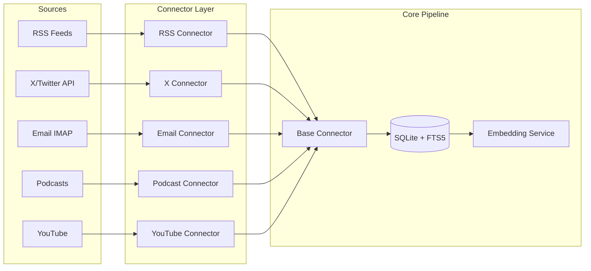

# Connector System Design Document

## Executive Summary

This document outlines the design for a pluggable connector system that ingests content from multiple source types (RSS, X/Twitter, Email, Podcast, YouTube) into a unified data pipeline. The system emphasizes modularity, type safety, and consistent behavior across all connector types.

## System Overview

### Architecture Diagram



### Data Flow

```mermaid
graph LR
    A[Connector fetches data] --> B[Normalize to Post model]
    B --> C[Generate content_hash]
    C --> D{Duplicate check using composite hash}
    D -->|New content| E[Insert into 'posts' table]
    D -->|Duplicate| F[Skip/Log duplicate]
    E --> G[Trigger updates posts_fts for search]
    E --> H[Generate embeddings]
    H --> I[Store in 'embeddings' table]
    I --> J[Clustering pipeline]
    J --> K[Update 'clusters' & 'post_clusters' tables]

**Deduplication Strategy**:
- **Composite Hash**: Combines source_id, source_guid/URL, and content
- **Cross-Source Content**: Same article from different sources creates separate entries
- **Within-Source Deduplication**: Prevents re-processing identical content from same source
- **Fallback Identifiers**: Uses source_guid (preferred) → URL → content-only as hash components
```

## Design Principles

1. **Single Responsibility**: Each connector handles one source type
2. **Interface Segregation**: Minimal required interface for connector implementation
3. **Dependency Inversion**: Connectors depend on abstractions, not concrete implementations
4. **Open/Closed**: Easy to add new connectors without modifying existing code
5. **Type Safety**: Full typing with Pydantic models and type hints

## Core Components

### 1. Configuration System

Configuration uses a layered approach with file-based defaults and environment overrides:

```python
# Base configuration interface
class BaseConnectorConfig(BaseModel):
    enabled: bool
    fetch_interval_minutes: int
    max_items_per_fetch: Optional[int]
    retry_attempts: int
    timeout_seconds: int
    custom_headers: Optional[Dict[str, str]]

# Example: RSS-specific configuration
class RSSConfig(BaseConnectorConfig):
    parse_full_content: bool
    filter_keywords: Optional[List[str]]
    exclude_keywords: Optional[List[str]]
```

**Configuration Hierarchy**:
```
config/
├── connectors/
│   ├── defaults/
│   │   ├── rss.yaml      # Default RSS settings
│   │   ├── x_api.yaml    # Default X/Twitter settings
│   │   └── ...
│   └── config.yaml       # Main config with source definitions
```

**Loading Strategy**: 
1. Load connector defaults from `config/connectors/defaults/{connector_type}.yaml`
2. Apply source-specific overrides from main `config.yaml`
3. Apply environment variable overrides for secrets

### 2. Base Connector Interface

All connectors implement this interface:

```python
class BaseConnector(ABC):
    """Abstract base class for content connectors implementing Template Method Pattern."""
    
    def __init__(self, source: Source, db: Database, http_client: httpx.AsyncClient):
        """Initialize with source configuration, database connection, and shared HTTP client."""
        self.source = source
        self.db = db
        self.http_client = http_client
        self.logger = logging.getLogger(f"{self.__class__.__name__}:{source.name}")
        
    @abstractmethod
    async def fetch_raw_data(self, fetch_state: Optional[Dict[str, Any]] = None) -> AsyncIterator[Dict[str, Any]]:
        """
        Yield raw data items from the source.
        
        Args:
            fetch_state: Previous fetch state for incremental fetching
                        (e.g., {'last_seen_id': 'xyz', 'last_fetch_timestamp': '2024-01-01T00:00:00Z'})
        """
        
    @abstractmethod
    def normalize_to_post(self, raw_data: Dict[str, Any]) -> Optional[Post]:
        """Convert raw data to normalized Post model."""
        
    def extract_fetch_state(self, post: Post) -> Dict[str, Any]:
        """
        Extract fetch state from a processed post for incremental fetching.
        Override in subclasses for source-specific state extraction.
        
        Args:
            post: Processed post object
            
        Returns:
            State dictionary for next fetch
        """
        return {
            'last_seen_id': post.source_guid or post.url,
            'last_fetch_timestamp': datetime.utcnow().isoformat()
        }
    
    async def run(self) -> Dict[str, int]:
        """
        Execute fetch operation with standardized orchestration.
        
        Template Method Pattern: Defines the algorithm structure while allowing
        subclasses to customize specific steps (fetch_raw_data, normalize_to_post).
        
        Returns:
            Statistics dictionary with counts for fetched/new/duplicate/error items
        """
        stats = {
            'fetched': 0,
            'new': 0, 
            'duplicate': 0,
            'error': 0
        }
        
        try:
            # 1. Get previous fetch state
            fetch_state = await self.db.get_source_fetch_state(self.source.id)
            
            # 2. Fetch raw data with incremental support
            last_processed_post = None
            async for raw_item in self.fetch_raw_data(fetch_state):
                stats['fetched'] += 1
                
                try:
                    # 3. Normalize to Post model
                    post = self.normalize_to_post(raw_item)
                    if not post:
                        continue
                        
                    # 4. Set source_id and generate composite hash
                    post.source_id = self.source.id
                    post.content_hash = Post.generate_content_hash(
                        post.source_id, post.content, post.url, post.source_guid
                    )
                    
                    # 5. Check for duplicates
                    if await self.db.post_exists_by_hash(post.content_hash):
                        stats['duplicate'] += 1
                        continue
                        
                    # 6. Insert new post
                    await self.db.insert_post(post)
                    stats['new'] += 1
                    last_processed_post = post
                    
                except Exception as e:
                    self.logger.error(f"Error processing item: {e}")
                    stats['error'] += 1
                    
            # 7. Update fetch state if we processed any items
            if last_processed_post:
                new_state = self.extract_fetch_state(last_processed_post)
                await self.db.update_source_fetch_state(self.source.id, new_state)
                
        except Exception as e:
            self.logger.error(f"Fatal error in connector run: {e}")
            raise
            
        return stats
```

**Template Method Pattern Benefits**:
- **Standardized Flow**: All connectors follow identical orchestration (fetch → normalize → dedupe → save)
- **Reduced Complexity**: Individual connectors only implement 2 abstract methods
- **Consistent Error Handling**: Unified error handling and statistics tracking
- **Incremental Fetching**: Built-in support with customizable state extraction
- **Maintainability**: Core logic changes automatically apply to all connectors

### 3. Concurrency Control

**ConnectorPool** manages concurrent execution with resource limits:

```python
class ConnectorPool:
    """Manages concurrent connector execution with resource limits."""
    
    def __init__(self, max_concurrent: int = 10):
        """
        Initialize pool with concurrency limit.
        
        Args:
            max_concurrent: Maximum simultaneous connector executions
        """
        self.semaphore = asyncio.Semaphore(max_concurrent)
        self.http_client = httpx.AsyncClient(
            timeout=httpx.Timeout(30.0),
            limits=httpx.Limits(max_connections=100, max_keepalive_connections=20)
        )
    
    async def run_connector(self, connector_class: Type[BaseConnector], 
                          source: Source, db: Database) -> Dict[str, int]:
        """Run a single connector with concurrency control."""
        async with self.semaphore:
            connector = connector_class(source, db, self.http_client)
            return await connector.run()
    
    async def close(self):
        """Clean up resources."""
        await self.http_client.aclose()
```

**Usage Pattern**:
```python
async def run_all_connectors(sources: List[Source], db: Database):
    pool = ConnectorPool(max_concurrent=10)
    try:
        tasks = [
            pool.run_connector(get_connector_class(source.type), source, db)
            for source in sources if source.active
        ]
        results = await asyncio.gather(*tasks, return_exceptions=True)
    finally:
        await pool.close()
```

### 4. Error Handling & Resilience

**Exception Hierarchy**:
```python
# src/connectors/exceptions.py
class ConnectorError(Exception):
    """Base exception for all connector errors."""
    
class RateLimitError(ConnectorError):
    """Raised when API rate limit is exceeded."""
    def __init__(self, retry_after: Optional[int] = None):
        self.retry_after = retry_after
        
class AuthenticationError(ConnectorError):
    """Raised when authentication fails."""
    
class NetworkError(ConnectorError):
    """Raised for network-related failures."""
    
class ParseError(ConnectorError):
    """Raised when content parsing fails."""
```

**Circuit Breaker Pattern**:
```python
# src/connectors/resilience.py
class CircuitBreaker:
    """Circuit breaker for preventing cascading failures."""
    
    def __init__(self, failure_threshold: int = 5, recovery_timeout: int = 60):
        """
        Initialize circuit breaker.
        
        Args:
            failure_threshold: Failures before opening circuit
            recovery_timeout: Seconds to wait before retry
        """
        self.failure_threshold = failure_threshold
        self.recovery_timeout = recovery_timeout
        self.failure_count = 0
        self.last_failure_time: Optional[float] = None
        self.state = "closed"  # States: closed, open, half-open
    
    def call(self, func: Callable) -> Any:
        """Execute function with circuit breaker protection."""
        
    def record_success(self):
        """Reset failure count on success."""
        
    def record_failure(self):
        """Increment failure count and possibly open circuit."""
```

**Retry Strategy**:
```python
# Using tenacity library
from tenacity import retry, stop_after_attempt, wait_exponential, retry_if_exception_type

# Different retry strategies for different errors
@retry(
    retry=retry_if_exception_type(NetworkError),
    stop=stop_after_attempt(3),
    wait=wait_exponential(multiplier=1, min=4, max=10)
)
async def network_operation():
    pass

@retry(
    retry=retry_if_exception_type(RateLimitError),
    stop=stop_after_attempt(1),
    wait=wait_fixed(lambda e: e.last_attempt.outcome.exception().retry_after or 60)
)
async def rate_limited_operation():
    pass
```

### 5. Data Models

**Source Model** (existing, enhanced):
```python
class Source(BaseModel):
    id: Optional[int]
    type: SourceType  # Enum: RSS, TWITTER, EMAIL, PODCAST, YOUTUBE
    identifier: str  # Generic identifier: URL for RSS/YouTube, handle for Twitter, email for IMAP
    name: str
    config: Optional[Dict[str, Any]]  # Loaded from YAML config
    active: bool
    
    @property
    def typed_config(self) -> BaseConnectorConfig:
        """Return strongly-typed configuration object."""
        config_class = get_config_class(self.type)
        return config_class(**self.config) if self.config else config_class()
```

**Post Model** (existing, enhanced):
```python
class Post(BaseModel):
    source_id: int
    title: str
    content: str
    url: Optional[str]
    published_at: Optional[datetime]
    content_hash: str  # Composite hash for robust deduplication
    source_guid: Optional[str]  # Original source identifier (RSS GUID, Tweet ID, etc.)
    metadata_json: Optional[Dict[str, Any]]
    
    @classmethod
    def generate_content_hash(cls, source_id: int, content: str, 
                            url: Optional[str] = None, 
                            source_guid: Optional[str] = None) -> str:
        """
        Generate composite hash for robust deduplication.
        
        Combines source_id, content, and available identifiers to prevent
        false deduplication when the same content appears across different sources.
        
        Args:
            source_id: ID of the source
            content: Main content text
            url: Content URL if available
            source_guid: Source-specific identifier (RSS GUID, Tweet ID, etc.)
            
        Returns:
            SHA-256 hash string for deduplication
        """
        # Use source_guid if available (most reliable), otherwise fall back to URL
        identifier = source_guid or url or ""
        hash_input = f"{source_id}:{identifier}:{content}"
        return hashlib.sha256(hash_input.encode('utf-8')).hexdigest()
```

### 6. Connector Registry

Dynamic connector discovery and instantiation:

```python
CONNECTOR_REGISTRY: Dict[SourceType, Type[BaseConnector]] = {
    SourceType.RSS: RSSConnector,
    SourceType.TWITTER: XAPIConnector,
    SourceType.EMAIL: EmailConnector,
    SourceType.PODCAST: PodcastConnector,
    SourceType.YOUTUBE: YouTubeConnector,
}

def get_connector_class(source_type: SourceType) -> Type[BaseConnector]:
    """Factory method to get connector class by source type."""
    if source_type not in CONNECTOR_REGISTRY:
        raise ValueError(f"No connector registered for source type: {source_type}")
    return CONNECTOR_REGISTRY[source_type]
```

### 7. Fetch State Management

Connectors support incremental fetching to avoid re-processing content and respect rate limits:

```python
class FetchState(BaseModel):
    """Represents the state of the last successful fetch for a source."""
    source_id: int
    last_fetch_timestamp: datetime
    last_seen_id: Optional[str] = None  # Source-specific identifier
    metadata: Optional[Dict[str, Any]] = None  # Connector-specific state
    
    class Config:
        json_encoders = {
            datetime: lambda v: v.isoformat()
        }
```

**Usage in connectors:**
```python
# RSS Connector example
async def fetch_raw_data(self, fetch_state: Optional[Dict[str, Any]] = None) -> AsyncIterator[Dict[str, Any]]:
    last_seen_guid = fetch_state.get('last_seen_id') if fetch_state else None
    
    async for entry in self._parse_feed():
        if last_seen_guid and entry['guid'] == last_seen_guid:
            break  # Stop at previously seen content
        yield entry

# Twitter Connector example  
async def fetch_raw_data(self, fetch_state: Optional[Dict[str, Any]] = None) -> AsyncIterator[Dict[str, Any]]:
    since_id = fetch_state.get('last_seen_id') if fetch_state else None
    params = {'since_id': since_id} if since_id else {}
    
    async for tweet in self._fetch_tweets(params):
        yield tweet
```

### 7. Configuration Loader

```python
# src/intel/utils/config_loader.py
def load_connector_config(source_type: SourceType, source_config: Dict[str, Any]) -> Dict[str, Any]:
    """
    Load configuration with defaults and overrides.
    
    Args:
        source_type: Type of connector
        source_config: Source-specific config overrides
        
    Returns:
        Merged configuration dictionary
    """
    # 1. Load defaults from config/connectors/defaults/{source_type}.yaml
    default_path = f"config/connectors/defaults/{source_type.value}.yaml"
    with open(default_path) as f:
        defaults = yaml.safe_load(f)
    
    # 2. Merge with source-specific overrides
    config = {**defaults, **source_config}
    
    # 3. Apply environment variable overrides (for secrets)
    # E.g., ${X_BEARER_TOKEN} in config becomes os.getenv('X_BEARER_TOKEN')
    config = expand_env_vars(config)
    
    return config
```

## Implementation Requirements

### Required Functionality

1. **Deduplication**: Use composite content_hash (source_id + identifier + content) to prevent duplicate storage while allowing same content from different sources
2. **Error Handling**: Structured exceptions with circuit breaker pattern
3. **Rate Limiting**: Respect API limits with intelligent retry strategies
4. **Async Operations**: All I/O must be async with controlled concurrency
5. **Resource Management**: Shared HTTP client with connection pooling
6. **Statistics**: Track fetched/new/duplicate/error counts per source
7. **Incremental Fetching**: Track fetch state per source to avoid re-processing content

### Required Libraries

```toml
# pyproject.toml additions
[tool.poetry.dependencies]
httpx = "^0.27.0"          # Async HTTP client with connection pooling
tenacity = "^8.2.3"        # Retry logic with backoff strategies
pyyaml = "^6.0.1"          # YAML configuration parsing
aioimaplib = "^1.0.1"      # Async IMAP client for email connector
```

### Quality Attributes

| Attribute | Requirement | Approach |
|-----------|-------------|----------|
| **Performance** | Process 1000+ items/minute | Async I/O, batch operations |
| **Reliability** | 99% success rate | Retry logic, error isolation |
| **Scalability** | Support 100+ sources | Concurrent execution, connection pooling |
| **Maintainability** | Add new connector < 2 hours | Clear interfaces, base class reuse |
| **Security** | Secure credential handling | Environment variables, no hardcoding |

## Connector Specifications

### RSS Connector
- **Input**: RSS/Atom feed URLs
- **Features**: Full content extraction, keyword filtering, incremental fetching via GUID tracking
- **Dependencies**: feedparser, httpx
- **Incremental Strategy**: Track last seen GUID, process feeds in reverse chronological order

### X/Twitter Connector
- **Input**: Twitter handles (without @ prefix)
- **Features**: Tweet filtering, reply/retweet handling, incremental fetching via since_id
- **Dependencies**: httpx, Bearer token auth
- **Constraints**: API rate limits (Basic tier: 10k reads/month)
- **Incremental Strategy**: Use Twitter API since_id parameter

### Email Connector
- **Input**: IMAP server credentials and email addresses
- **Features**: Folder selection, attachment handling, sender filtering, incremental fetching via UID tracking
- **Dependencies**: aioimaplib (async IMAP), email parser
- **Incremental Strategy**: Track last processed UID per folder

### Podcast Connector
- **Input**: Podcast RSS feeds
- **Features**: Episode filtering, metadata extraction, incremental fetching via episode GUID
- **Dependencies**: feedparser, httpx, transcription service integration
- **Incremental Strategy**: Track last seen episode GUID

### YouTube Connector
- **Input**: Channel IDs or usernames
- **Features**: Video filtering, transcript extraction, metadata parsing, incremental fetching via video ID
- **Dependencies**: httpx, youtube-transcript-api or YouTube Data API
- **Incremental Strategy**: Track last processed video ID, use publishedAfter parameter

## Integration Points

### Database Interface
```python
class Database:
    async def post_exists_by_hash(self, content_hash: str) -> bool
    async def insert_post(self, post: Post) -> int
    async def get_active_sources(self) -> List[Source]
    
    # New methods for fetch state management
    async def get_source_fetch_state(self, source_id: int) -> Optional[Dict[str, Any]]:
        """
        Retrieve the last fetch state for a source.
        
        Args:
            source_id: ID of the source
            
        Returns:
            Fetch state dictionary or None if no previous state exists
        """
        
    async def update_source_fetch_state(self, source_id: int, fetch_state: Dict[str, Any]) -> None:
        """
        Update the fetch state for a source.
        
        Args:
            source_id: ID of the source
            fetch_state: New fetch state to store
        """
        
    async def update_source_status(self, source_id: int, status: str) -> None:
        """
        Update the status of a source (e.g., 'auth_failed', 'active').
        
        Args:
            source_id: ID of the source
            status: New status string
        """
```

### Required Database Schema Changes

To support the new functionality, the following schema changes are required:

```sql
-- New table for tracking fetch state per source
CREATE TABLE source_fetch_states (
    source_id INTEGER PRIMARY KEY,
    fetch_state TEXT NOT NULL,  -- JSON string of fetch state
    updated_at TIMESTAMP DEFAULT CURRENT_TIMESTAMP,
    FOREIGN KEY (source_id) REFERENCES sources (id)
);

-- Add status column to sources table
ALTER TABLE sources ADD COLUMN status TEXT DEFAULT 'active';

-- Add source_guid column to posts table for better deduplication
ALTER TABLE posts ADD COLUMN source_guid TEXT;

-- Index for faster hash lookups
CREATE INDEX idx_posts_content_hash ON posts (content_hash);
CREATE INDEX idx_posts_source_guid ON posts (source_guid);
```

### Pipeline Integration
```python
# Example usage in daily_report.py
async def run_connectors(db: Database):
    # Load sources from config
    sources = load_sources_from_config()
    
    # Create connector pool with concurrency limit
    pool = ConnectorPool(max_concurrent=10)
    
    try:
        # Create circuit breakers per source
        circuit_breakers = {
            source.id: CircuitBreaker() for source in sources
        }
        
        # Run all connectors with error handling
        tasks = []
        for source in sources:
            if source.active:
                task = pool.run_connector(
                    get_connector_class(source.type), 
                    source, 
                    db
                )
                # Wrap with circuit breaker
                protected_task = circuit_breakers[source.id].call(task)
                tasks.append(protected_task)
        
        results = await asyncio.gather(*tasks, return_exceptions=True)
        
        # Process results
        for source, result in zip(sources, results):
            if isinstance(result, Exception):
                logger.error(f"Failed to fetch {source.name}: {result}")
                if isinstance(result, AuthenticationError):
                    # Mark source as needing attention
                    await db.update_source_status(source.id, "auth_failed")
            else:
                logger.info(f"Fetched {source.name}: {result}")
                
    finally:
        await pool.close()
```

## Testing Strategy

### Unit Tests
- Configuration validation
- Post normalization logic
- Deduplication logic

### Integration Tests
- Database operations
- Full connector execution
- Error handling scenarios

### Contract Tests
- Each connector produces valid Post objects
- All required fields populated
- Content hash generation consistency

## Security Considerations

1. **Credentials**: Store in environment variables or keychain
2. **API Keys**: Never committed to repository
3. **Rate Limiting**: Prevent API abuse
4. **Input Validation**: Sanitize all external data
5. **Error Messages**: No sensitive data in logs

## Future Enhancements

1. **Webhook Support**: Push-based content ingestion
2. **Custom Connectors**: Plugin system for user-defined sources
4. **Content Enrichment**: Extract entities, sentiment
5. **Monitoring Dashboard**: Real-time connector status

## Migration Path

Since this is a greenfield implementation:
1. Implement base connector and configuration system
2. Create RSS connector as reference implementation
3. Validate design with stakeholders
4. Implement remaining connectors in parallel
5. Integration testing with full pipeline

## Success Metrics

- **Coverage**: All 5 source types implemented
- **Reliability**: < 1% failure rate in production
- **Performance**: < 5 second latency per source
- **Maintainability**: New connector implementation < 200 LOC
- **Adoption**: Successfully ingesting from 50+ sources

**Async Library Requirements**:
- All connectors must use async-compatible libraries
- Email Connector: `aioimaplib` instead of synchronous `imaplib`
- HTTP operations: `httpx` for all network requests
- Database operations: async database drivers only

## Appendix: File Structure

```
src/
├── connectors/
│   ├── __init__.py          # Registry and factory
│   ├── base.py              # BaseConnector class
│   ├── exceptions.py        # Custom exception hierarchy
│   ├── resilience.py        # CircuitBreaker implementation
│   ├── pool.py              # ConnectorPool for concurrency
│   ├── configs/
│   │   ├── __init__.py      # Config factory
│   │   ├── base.py          # BaseConnectorConfig
│   │   ├── rss.py           # RSSConfig
│   │   ├── x_api.py         # XAPIConfig
│   │   ├── email.py         # EmailConfig
│   │   ├── podcast.py       # PodcastConfig
│   │   └── youtube.py       # YouTubeConfig
│   ├── rss.py               # RSSConnector
│   ├── x_api.py             # XAPIConnector
│   ├── email.py             # EmailConnector
│   ├── podcast.py           # PodcastConnector
│   └── youtube.py           # YouTubeConnector
├── models/
│   ├── source.py            # Enhanced with typed_config
│   └── post.py              # Existing Post model
└── intel/
    └── utils/
        └── config_loader.py # Configuration loading logic

config/
├── connectors/
│   └── defaults/            # Default configs per connector type
│       ├── rss.yaml
│       ├── x_api.yaml
│       ├── email.yaml
│       ├── podcast.yaml
│       └── youtube.yaml
└── config.yaml              # Main configuration with sources
```

## Example Configuration Files

**config/connectors/defaults/rss.yaml**:
```yaml
# Default configuration for RSS connectors
enabled: true
fetch_interval_minutes: 60
max_items_per_fetch: 50
retry_attempts: 3
timeout_seconds: 30
parse_full_content: false
filter_keywords: null
exclude_keywords: null
```

**config/config.yaml** (sources section):
```yaml
sources:
  - type: rss
    name: "TechCrunch"
    identifier: "https://techcrunch.com/feed/"
    config:
      parse_full_content: true
      filter_keywords: ["AI", "machine learning"]
      
  - type: twitter
    name: "Elon Musk"
    identifier: "elonmusk"  # Twitter handle without @
    config:
      max_tweets_per_user: 20
      include_replies: false
      
  - type: email
    name: "Work Inbox"
    identifier: "user@company.com"
    config:
      imap_server: "imap.company.com"
      folder: "INBOX"
```
